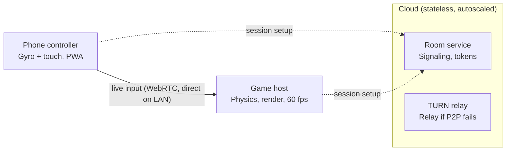

# Project Tilt: Phone-as-Steering-Wheel Kart Racer

Structured development plan covering architecture, controller design, security, scalability and performance.

> **IP note:** "Mario Kart style" describes the genre only (arcade kart racing, items, drifting). Characters, tracks, names and art must be original, since Nintendo actively protects that IP.

---

## 1. Product concept

Tilt is a couch-party kart racer. The game runs on a shared screen (PC, laptop or smart TV browser). Each player scans a QR code with their phone, and the phone becomes a steering wheel in the browser, with nothing to install. Players steer by turning the phone like a wheel and use touch zones for gas, brake, drift and items.

This "no install" decision drives the rest of the plan. Friction at the join step is what kills party games, so the controller must be a web page that opens in under two seconds.

---

## 2. System architecture

The main architectural choice: **the cloud only introduces the devices, and gameplay traffic goes directly from phone to host.**



Why this shape: in local mode the servers carry only a few kilobytes per session (join, SDP/ICE exchange), so a million matches cost almost the same as a thousand. The latency-sensitive path never leaves the room's Wi-Fi.

---

## 3. The controller

### 3.1 Sensor pipeline

Read `DeviceMotionEvent` in the browser. Gyroscope alone drifts over time, and gravity (accelerometer) alone is noisy and laggy. The standard fix is a complementary filter: the gyro gives instant response, and gravity slowly pulls the angle back to truth. The wheel axis is the one perpendicular to the screen (`rotationRate.alpha`).

```ts
function onMotion(e: DeviceMotionEvent) {                 // ~60 Hz, on the phone
  const now = performance.now(), dt = (now - last) / 1000; last = now;
  const g = e.accelerationIncludingGravity!;
  const gyroAngle = angle + (e.rotationRate?.alpha ?? 0) * dt;        // fast, but drifts
  const tiltAngle = wrap180(toDeg(Math.atan2(g.y!, g.x!)) - center);  // slow, drift-free
  const trust = 0.02 * Math.min(1, Math.hypot(g.x!, g.y!) / 9.81);    // phone near flat => trust gravity less
  angle = (1 - trust) * gyroAngle + trust * tiltAngle;
  channel.send(encode(seq++, shape(angle / MAX_ANGLE), buttons));
}
```

`shape()` applies a small dead zone (about 4%) and a response curve (exponent around 1.5) so small corrections feel precise and full lock is still reachable. `MAX_ANGLE` defaults to 90° and is player-adjustable. Sign conventions for motion data have historically differed between iOS and Android browsers, so normalize them in a single adapter and validate on real devices.

### 3.2 Platform requirements that affect design

- iOS Safari only grants motion data after `DeviceMotionEvent.requestPermission()` is called from a tap, over HTTPS. The first controller screen must be a "Tap to start your engine" button, which doubles as the permission prompt.
- The Screen Wake Lock API keeps the phone from sleeping mid-race.
- Landscape lock works on Android (in fullscreen); iOS needs a "rotate your phone" overlay.
- `navigator.vibrate` gives haptics on Android only. If haptics on iOS become a priority, a thin native wrapper (Capacitor) is the path, and it's a Phase 3 decision.

### 3.3 Controller UX

Calibration screen ("hold like a wheel, tap to center"), sensitivity slider, left/right-hand layouts, and a touch-slider steering fallback for phones without a gyroscope or for players who prefer it. Gas and brake live under the thumbs as large touch zones; drift and item are secondary buttons.

---

## 4. Input protocol

Send **state, not events**: every packet contains the full current input, so a lost packet costs nothing because the next one replaces it.

| Field   | Type   | Notes                                          |
|---------|--------|------------------------------------------------|
| type    | uint8  | 1 = input                                      |
| seq     | uint16 | Host drops anything older than the last seen   |
| steer   | int16  | −32767 to 32767                                |
| buttons | uint8  | Bitmask: gas, brake, drift, item, pause        |

That's 6 bytes at 60 Hz, roughly 360 B/s per player. Transport is a WebRTC DataChannel configured as unordered with `maxRetransmits: 0` (UDP-like behavior; TCP retransmits would add latency spikes). WebSocket through the room service is the fallback for networks with client isolation, common on hotel and university Wi-Fi.

On the host, if no packet arrives for 100 ms, hold the last value; after 500 ms, go neutral and pause with a "Player 2 disconnected" overlay. A reconnect token lets the phone rejoin its own slot.

---

## 5. Game host and tech stack

| Layer        | Recommendation                          | Why                                                   |
|--------------|------------------------------------------|-------------------------------------------------------|
| Host game    | TypeScript + Babylon.js (or Three.js)   | Runs in any browser, same language as controller      |
| Physics      | Rapier (WASM), custom arcade kart model | Fast, deterministic-capable, helps with online later  |
| Controller   | Vanilla TS or Preact, under 50 KB       | Must load instantly on 4G                             |
| Room service | Node.js (uWebSockets.js) or Go, Redis   | Stateless, horizontally scalable                      |
| Relay        | coturn                                  | Standard TURN server                                  |

Unity or Godot are valid if Steam and consoles are the target; you'd still keep the web controller. Browser-first wins for a party game because the host is also zero-install.

Kart handling should be arcade, not simulation: a raycast vehicle with yaw rate scaled by speed, a drift state with charge-based mini-turbos, and light rubber-banding for AI. Physics runs on a fixed 60 Hz timestep, decoupled from rendering.

---

## 6. Security

- **Joining:** room codes are short-lived (expire with the lobby) and the QR carries a signed token (HMAC, single use per slot). Rate-limit join attempts per IP to block code brute-forcing.
- **Transport:** HTTPS/WSS everywhere (iOS requires it for sensors anyway). WebRTC is encrypted by default via DTLS.
- **Never trust the phone:** it sends intents only. The host clamps `steer` to [−1, 1], validates packet size and type, drops streams above 120 packets/s, and computes all physics. A modified controller can't produce a speed hack because speed never comes from the client.
- **Data (LGPD/GDPR):** local play needs no account and no personal data. Nicknames go through a profanity filter and are discarded when the room closes.
- **Supply chain:** strict Content-Security-Policy, lockfile auditing in CI, no third-party scripts on the controller page.

---

## 7. Scalability

Local mode scales almost for free: static files on a CDN, a stateless room service behind a load balancer with room state in Redis (with TTL), and TURN capacity budgeted for the 10–20% of sessions where direct P2P fails.

Online multiplayer is a separate phase with a different model: an authoritative server simulation, client-side prediction with reconciliation, dedicated servers per region orchestrated by Agones or a managed provider, and region-based matchmaking. Designing physics to be deterministic from day one keeps that door open.

---

## 8. Performance budgets

| Stage                                | Budget      |
|--------------------------------------|-------------|
| Sensor sample                        | ≤ 16 ms     |
| Phone → host over LAN                | 5–15 ms     |
| Host simulation tick                 | ≤ 16 ms     |
| Render + display                     | 16–33 ms    |
| **Phone-to-host input (p95)**        | **< 30 ms** |
| **Tilt-to-screen total (p95)**       | **< 70 ms** |

Host target is 60 fps on a mid-range laptop: instanced rendering, KTX2 compressed textures, object pooling, LOD on track props. Instrument from the first sprint (RTT, packet loss, fps, per-device stats via OpenTelemetry) so you tune with data rather than guesses.

---

## 9. Roadmap

| Phase                 | Duration   | Exit criteria                                                              |
|-----------------------|------------|------------------------------------------------------------------------------|
| 0. Technical spike    | 2 weeks    | One phone steers a cube; p95 input < 30 ms on iOS and Android              |
| 1. Vertical slice     | 6–8 weeks  | 1 track, 1 kart, 4 players, drift, lap timing; playtest says "feels good"  |
| 2. Content alpha      | 8–10 weeks | 4 tracks, 8 original characters, items, AI bots, Grand Prix                |
| 3. Beta hardening     | 4–6 weeks  | Load tests, security review, 20-device test matrix, accessibility pass     |
| 4. Online             | Later      | Authoritative servers, matchmaking, anti-cheat                             |

Phase 0 is the go/no-go gate. If steering doesn't feel good at that stage, no amount of content will fix it.

---

## 10. Main risks

| Risk                              | Mitigation                                                           |
|------------------------------------|------------------------------------------------------------------------|
| iOS permission friction           | Permission bundled into the "start" tap, clear copy explaining why   |
| Wi-Fi blocks P2P                  | WebSocket/TURN fallback, detected automatically                      |
| Steering feels floaty or twitchy  | Tunable filter + curve, player sensitivity, early playtests          |
| Phone sleeps or heats up          | Wake Lock, minimal controller rendering, no animations in hot path   |
| IP infringement                   | Original characters and names, legal check before public release     |

---

## Next step

Start Phase 0: a two-file prototype (host page + controller page) to validate latency and steering feel before committing to the rest of the roadmap.
